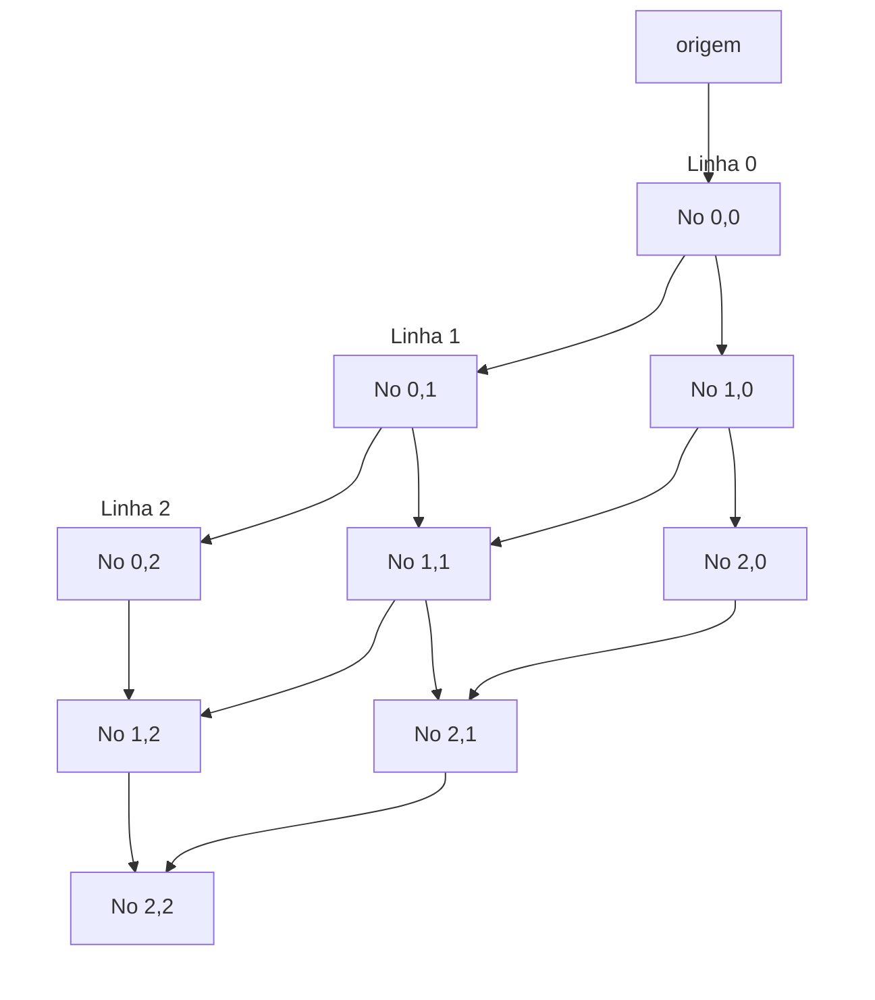
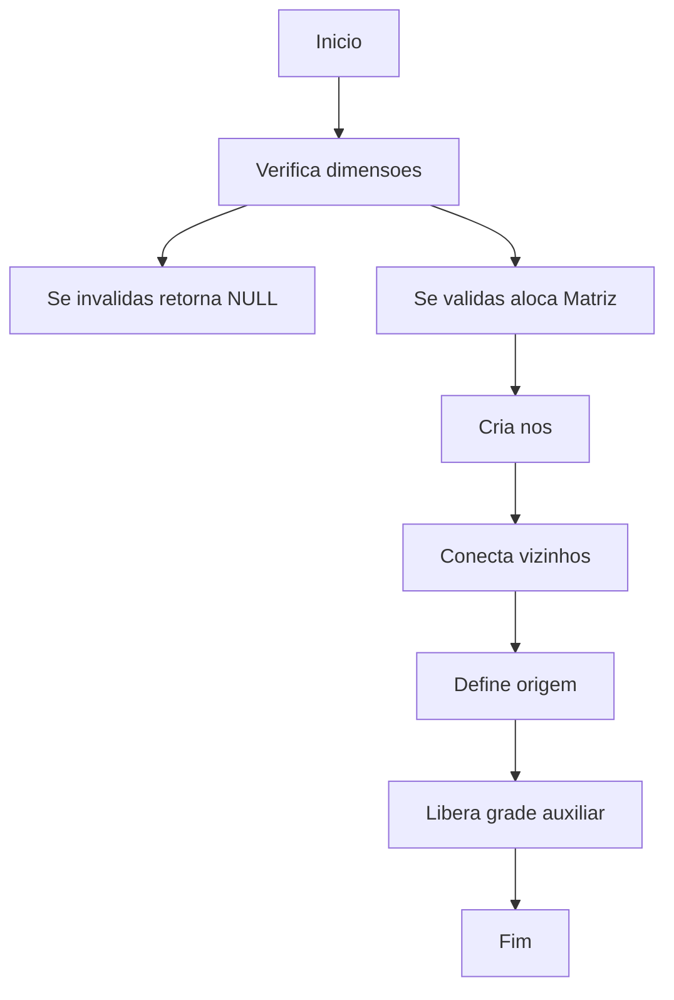
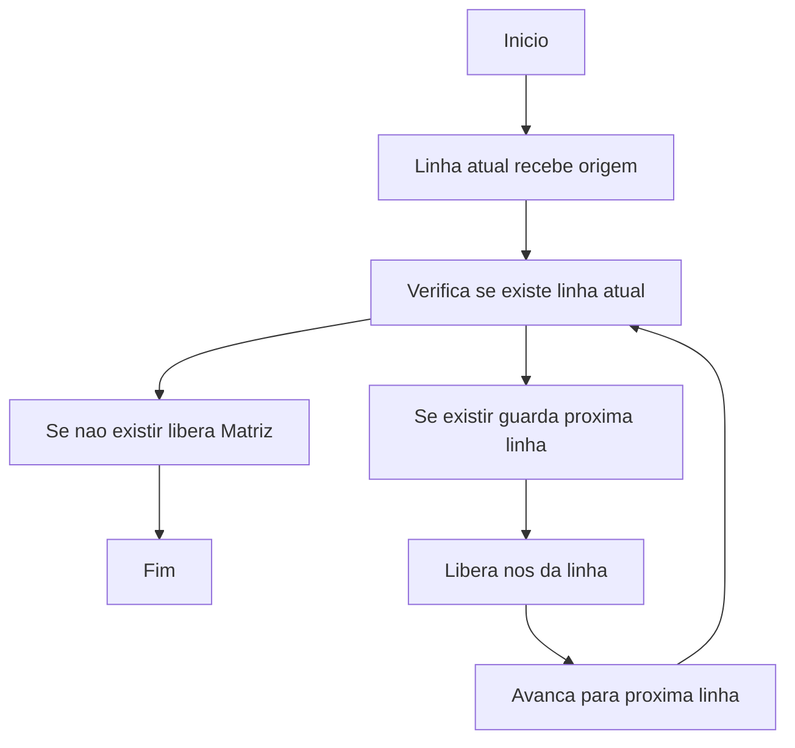
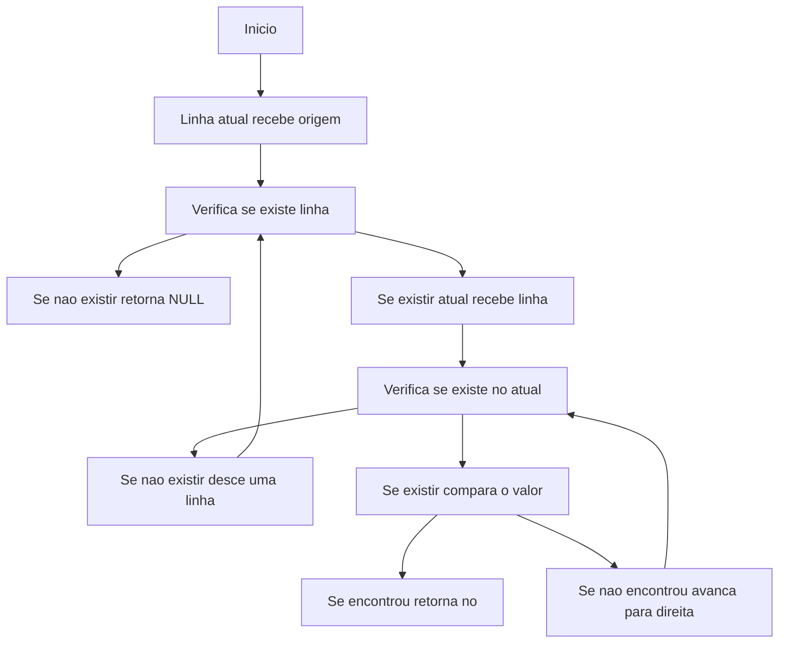
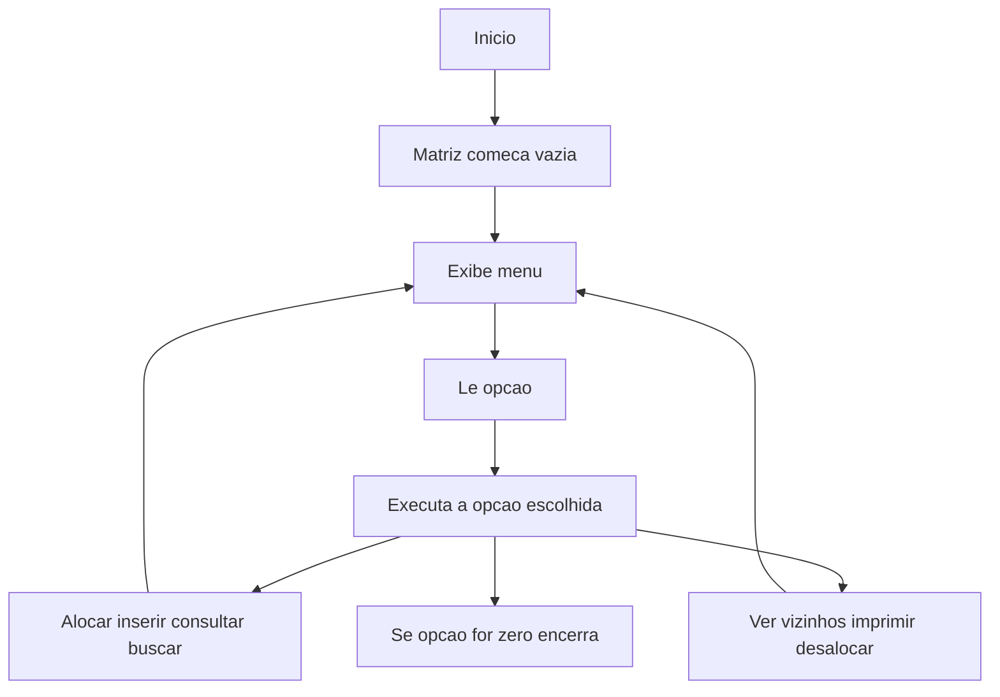

# Trabalho 1 — Matriz Bidimensional com Listas Encadeadas

**Disciplina:** Algoritmos e Estrutura de Dados III  
**Docente:** Thiago Naves  
**Instituição:** UTFPR — Campus Santa Helena

---

## 1. O Problema

Em C, uma matriz convencional (`int m[3][4]`) armazena todos os elementos em um bloco contínuo de memória e o acesso é feito por índice numérico.

Neste trabalho, cada elemento da matriz é um **nó alocado individualmente** na memória. Em vez de índices, os nós se conectam por meio de **ponteiros**, formando uma grade encadeada. A ideia é simular o comportamento de uma matriz convencional usando essa estrutura.

---

## 2. Estrutura de Dados

### 2.1 O Nó (`struct No`)

Cada célula da grade é um `No`. Além do valor armazenado, ele conhece sua posição e guarda ponteiros para os quatro vizinhos diretos.

```c
typedef struct No {
    int valor;           // número inteiro desta célula
    int x;               // coluna (índice horizontal)
    int y;               // linha  (índice vertical)
    struct No *esquerda;
    struct No *direita;
    struct No *cima;
    struct No *baixo;
} No;
```

Se um vizinho não existe (borda da matriz), o ponteiro vale `NULL`.

### 2.2 A Matriz (`struct Matriz`)

```c
typedef struct Matriz {
    No *origem;  // ponteiro para o nó (0,0)
    int linhas;
    int colunas;
} Matriz;
```

O campo `origem` aponta para o canto superior esquerdo. A partir dele, todos os outros nós são alcançáveis seguindo os ponteiros.

### 2.3 Visualização da grade (3×3)



> Para manter o diagrama legível, ele mostra apenas algumas ligações para direita e para baixo. As referências para esquerda e para cima existem também, como ponteiros inversos.
>
> As setas horizontais representam o ponteiro `direita`; as verticais representam o ponteiro `baixo`.
>
> Os nós das bordas têm ponteiros `NULL` nos sentidos sem vizinho (ex: `(0,0)->esquerda == NULL` e `(0,0)->cima == NULL`).

---

## 3. Arquivos do Projeto

| Arquivo | Função |
|---|---|
| `matriz.h` | Define os tipos (`No`, `Matriz`) e declara os protótipos das funções |
| `matriz.c` | Implementa todas as funções |
| `main.c` | Contém `main()` com o menu interativo |

O bloco `#ifndef MATRIZ_H / #define / #endif` em `matriz.h` evita que o arquivo seja incluído mais de uma vez na mesma compilação.

---

## 4. Funções — Como Funcionam

### `alocarMatriz(linhas, colunas)`



**Por que dois laços separados?**  
No primeiro laço os nós ainda não existem todos. Só no segundo, com todos já criados, é possível conectá-los com segurança.

O array `grade` é apenas uma escada temporária para construção — depois de conectar tudo, ele é descartado com `free()`.

---

### `desalocarMatriz(m)`



> **Detalhe importante:** o ponteiro `->baixo` é salvo *antes* do `free()`. Após liberar um nó, acessá-lo causa comportamento indefinido — por isso salvamos o endereço com antecedência.

---

### `consultar(m, x, y)`

Navega pelos ponteiros encadeados a partir de `(0,0)`:


1. Valida se `x` e `y` estão dentro dos limites.
2. Parte de `m->origem`.
3. Segue `->baixo` por `y` passos → chega na linha correta.
4. Segue `->direita` por `x` passos → chega na coluna correta.
5. Retorna o nó (ou `NULL` se inválido).

---

### `inserir(m, x, y, valor)`

Usa `consultar()` para localizar o nó e simplesmente atribui o valor:

```c
No *no = consultar(m, x, y);
if (!no) return 0;   // fora dos limites
no->valor = valor;
return 1;            // sucesso
```

---

### `buscar(m, valor)`

Varredura completa linha por linha:



---

### `imprimirVizinhos(m, x, y)`

Usa `consultar()` para obter o nó e então acessa diretamente os quatro ponteiros de vizinhança. Se o ponteiro for `NULL` (borda), imprime `"NULL"`.

---

## 5. Menu Interativo (`main.c`)



A função `limparBuffer()` descarta o `\n` que fica no buffer do teclado após cada `scanf`, evitando que leituras seguintes recebam uma entrada vazia.

---

## 6. Conceitos Fundamentais de C

### Ponteiro
Uma variável que guarda o **endereço** de outra variável na memória.

```c
int x = 42;
int *p = &x;  // p guarda o endereço de x
*p = 10;      // altera x através do ponteiro → x agora vale 10
```

No projeto, `no->direita` guarda o endereço do nó vizinho. Seguir esse ponteiro significa "ir até aquele nó na memória". `NULL` significa "não há vizinho aqui".

### `malloc` e `free`
- `malloc(tamanho)` — reserva um bloco de memória e retorna seu endereço.
- `free(ponteiro)` — devolve esse bloco ao sistema operacional.

Todo `malloc()` deve ter um `free()` correspondente para evitar **vazamento de memória**.

---

## 7. Desafios e Dificuldades

| Desafio | Como foi resolvido |
|---|---|
| Gerenciar memória em caso de falha | Em cada `malloc()`, se falhar, todo o que já foi alocado é liberado antes de retornar `NULL` |
| Ordem de construção dos nós | Dividir `alocarMatriz` em dois laços: primeiro criar, depois conectar |
| Desalocação segura | Salvar o ponteiro `->baixo` e `->direita` antes de chamar `free()` |
| Clareza sobre `x = coluna` e `y = linha` | Comentários explícitos no código e consistência nas assinaturas das funções |
| Menu interativo com `scanf` | Uso de `limparBuffer()` após cada leitura para evitar entradas espúrias |
